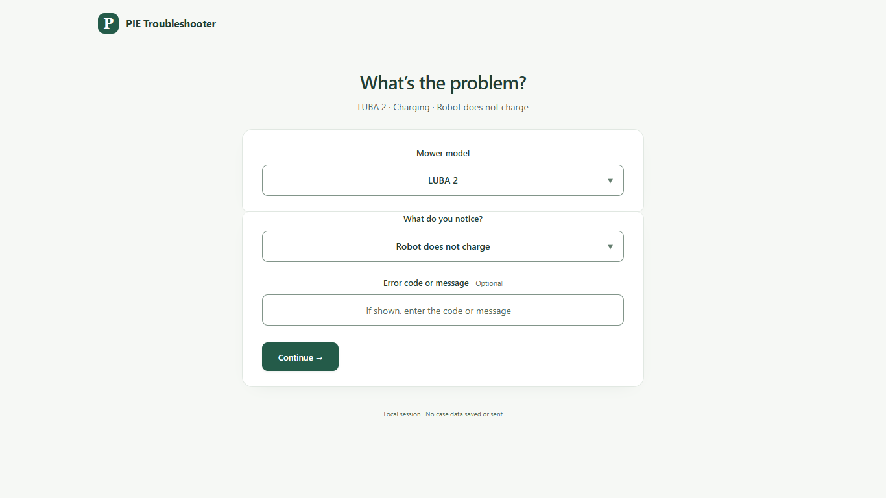
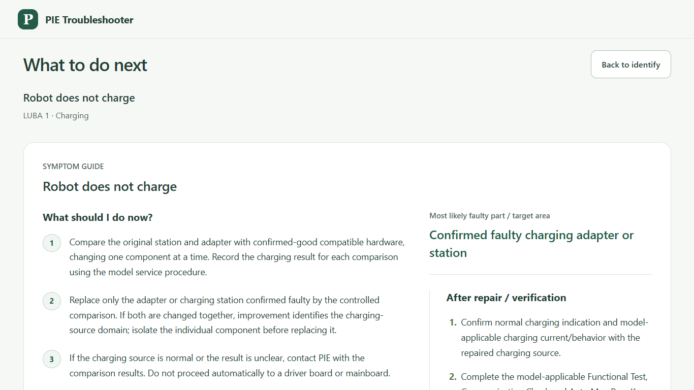

# EC-MT-20260915-SIMPLE-KNOWLEDGE-REUSE-008 主管审查报告

本轮完成时间：2026-09-16（Europe/Berlin）。最终 Gate：**TROUBLESHOOTER_SIMPLE_KNOWLEDGE_GREEN**。

任务依据：Issue #5 [READY 任务](https://github.com/lulululucy1227/PIE-ITR-1/issues/5#issuecomment-5688583559)，及其已批准设计、实施计划、Evidence Promotion Policy。以专项最新本地状态 `4fa5456c23f4292531e3dbb6410087f238508279` 为基线，没有回退至旧 main。

工作区：`C:\Users\Reggie\Desktop\PIE-ITR-ErrorCode`。分支：`error-code/ec-mt-20260907-pilot-001-canonical`。本报告为任务授权范围内的本地自审通过，主管验收由主管另行进行。模型/effort 的任务要求保留在 Issue #5；本报告不把未独立核实的运行设置当作验收证据。

## 用户现在看到的变化

- 原来正常流程必须选择 Model、Area、Symptom；现在只需 **Model → 分组的受控 Symptom → Continue → Repair**。独立必选项由 3 个减少到 2 个，普通路径只提交一次。
- 同一页面渐进显示问题，保留机型和已选症状。Area 由症状元数据确定，无单独必选控件。
- Error Code / Message 仍是可选文本。精确/模糊消息均不能绕过受控症状；模糊匹配仍需明确选择候选。
- Firmware 平常隐藏，只在路径确有版本条件时显示；其他条件也只在改变路径时询问。全局 Other 始终仅转 PIE，补充文字不产生故障件或换件结论。
- Page 2 将 **What should I do now?** 放在操作区最前面，随后是已支持的目标区域、验证、失败后的安全下一步。保留成熟步骤，不新增仪表盘、料号墙或空资源模块。
- 修复了旧版无效 Back 和确认阶段重复 Continue。已有未来工具、料号、拆装支持接口仍按完整指令、机型、路径和版本校验；没有资源时不显示空模块。

## 来源与复用结果

实际 Reply Assistant 工作区：`C:\Users\Reggie\Desktop\ITR工单助手\工单助手交接包\ticket_assist`。

实际活动知识库：`C:\Users\Reggie\Desktop\ITR工单助手\工单助手交接包\维修与售后知识库\07-标准知识`。通过 settings.py 的 VAULT 同级目录解析确认，未发现配置或进程环境覆盖。

五个指定知识家族来自工作区 `external/pie-itr-workbench/docs/knowledge/`：ERROR_CODES、KNOWN_FIXES、DIAGNOSTIC_KNOWLEDGE、PARTS_KNOWLEDGE、TOOL_KNOWLEDGE。其 external README 明确这是备查副本；没有将 9 月 14 日复制时间当成新技术审批。另一个 ticket_assist-governance 副本与其字节一致；旧 `Desktop/PIE-ITR-1/docs/knowledge` 仅有换行差异。

活动知识库另检查 6 份对应资料：供电充电 IF 规则、维修工具与刷写标准 SOP、版本适用与失效规则、引导式维修路径、料号依据总索引、错误码总表。引导式维修路径明确来自本专项 9 月 8 日版本，记为重复，不能充当独立成熟证据。

共 11 份文件，18 条精选事实/处置记录。来源文件、章节、字节数、SHA256 见 [manifest](../data/reuse-manifest.json) 和 [最小脱敏快照](../data/reuse-snapshot.json)。本轮结束再次逐一读取，11/11 哈希与开始记录一致，见 [source-readback](task008-evidence/source-readback.json)。仅复制改写后的最小技术事实与处置元数据；未复制原始工单、账号值、客户标识或完整目录。

| 分类 | 数量 |
|---|---:|
| PUBLIC_REPAIR_FACT | 3 |
| PUBLIC_TOOL_STEP | 1 |
| PUBLIC_PART_FACT | 1 |
| PRIVATE_INTERNAL | 3 |
| NEEDS_SCOPE_REVIEW | 6 |
| CONFLICT | 2 |
| DUPLICATE | 2 |

5 张成熟卡各替换一条原有操作说明，未增加步骤数量：

| 卡片 | 实际补强 |
|---|---|
| guide-no-charge | 原充电站/适配器与确认正常且兼容的参考件逐个对比，记录各次结果。 |
| guide-bumper | 区分传感器本体和机器侧感知链路；参考机器验证正常时转 PIE，只有确认故障且可单独维修才更换。 |
| guide-visible-cable-damage | 可见线束损伤先核对准确机型的 SBOM 与服务图；资料冲突或不可单独维修时转 PIE。 |
| guide-power | 使用机型支持的供电检查，记录开机指示状态，断电后按安全程序检查按钮和供电连接。 |
| guide-update-failure | 使用机型支持的当前工具，记录固件/模块版本、具体失败步骤、错误和通信结果再重试。 |

新维修路径 **0**，新 SKU 推荐 **0**。保持 31 张公开卡、25 个公开受控症状、9 个成熟 Guidance／10 张 scoped guidance cards。原始 canonical 不改写，构建时经白名单审查与公开投影应用补强；投影版本 `2026-09-15-simple-knowledge-reuse.1`。运行时不读取 Reply Assistant。

两项冲突保留内部：旧软件目标与后来已审查纠正冲突；DT-041 与官方数字码表说明存在来源差异。历史固件、GNSS、超出试点机型的料号、活动库刷写/代码汇总等弱范围资料没有自动发布。1202 冻结、PIE_ONLY、POS/WIFI/LIDAR 的窄路径、进水/物理损伤边界均保留。

快照摘要采用规范化 JSON 的 SHA256：`34d9e89f782e5dffbbe146cab2977a57fbb3c90d9d2b516ffde2610aa3ad65b6`。该值不同于带缩进文件的原始字节摘要，算法见 reuse.mjs。

## 修复与独立审查

独立审查发现并复验修复：

1. 启动器以前只认页面标题，可能打开另一目录的旧包。现在核对目录和六个公开资源的哈希身份；仅复用匹配服务，其他占用端口安全跳过，不终止其他程序。
2. 隐藏旧 Back，取消导致重复 Continue 的样式覆盖；真实浏览器先复现失败，再验证修复。
3. 知识补强绑定原指令 SHA256。若 canonical 后续获批更正了原指令，旧快照不能静默覆盖，构建要求重新审查。
4. 精简新知识中的解释性文字，保留可执行动作与必要停止条件，不新增长篇背景说明。

独立审查记录：[FINAL_SIMPLE_KNOWLEDGE_REVIEW_2026-09-15.md](FINAL_SIMPLE_KNOWLEDGE_REVIEW_2026-09-15.md)。

## 本轮最终验证

所有结果均来自本轮最终修改后的运行。原始记录保存在 [task008-evidence](task008-evidence/)。

| 验证 | 结果 |
|---|---|
| 全量 Node 自动化 | 96/96，通过；含来源/投影、控件、范围、料号、版本、1202、失败/复发、启动器等。 |
| 知识复用专项 | 8/8，包含快照篡改、来源不匹配、冲突/撤回/范围变化和原指令变化拒绝。 |
| Simple Knowledge 浏览器 | 3 个宽度：1366、1920、390；两项必选、一次普通提交、Other 安全。 |
| Controlled Selection | 19 项。 |
| 两页流程 | 32 项。 |
| Stable Guidance | 21 项，保留 10 张 scoped cards。 |
| Refinement / Service | 各 3 项。 |
| Single Panel | 通过；同页保留选项、无旧 Back、确认时无重复 Continue。此脚本输出 stdout，无单独 JSON。 |
| Windows Edge 实际 125% | 1366×768、1920×1080；DPR 1.25，视口宽 1093/1536；各 10 张 scoped guides，无横向溢出、页面异常或外部请求。 |
| 生命周期 | 8806 上两轮启动→仅停止所属进程→重启，均 HTTP 200。 |
| 独立包 | 11 项精确白名单；运行环境存在；解压启动、再次打开复用、六个 HTTP 资源字节一致、全部文件哈希一致、所属进程退出。 |
| Privacy | 源文件、内部审核、原始工单、个人标识不进入公开投影或压缩包；包内容扫描通过。 |

浏览器检查覆盖返回保留选择、修改输入即清除旧结果、刷新/直达/forward 不恢复过期维修答案、伪造机型和症状 ID 拒绝、exact/message/fuzzy/unsupported、PIE_ONLY、Other、失败/复发与 1202。

本地包（仅生成和本地验证，未对外分发）：

`C:\Users\Reggie\Desktop\PIE-ITR-ErrorCode\error-code-pilot\artifacts\error-code-pilot-20260916-000623.zip`

SHA256：`c034c643a1cf2317f791630f85a5ce6f4c6221d6dcb43ea4d9c4052453e6ad9d`。

MAIN 工作区、8787、业务配置、会话和案件状态未改动。没有生产写入、公开部署或合并/推送 main。只提交专项分支，报告只写 Issue #6。

当前交付无必须等待用户的业务决策。被保留的弱范围资料若日后希望发布，需要对应机型、现行工具/版本及准确零件适配证据；不阻塞本轮 Gate。
